Задание

Операционные системы и виртуализация (Linux)

1. Использование команды cat в Linux
   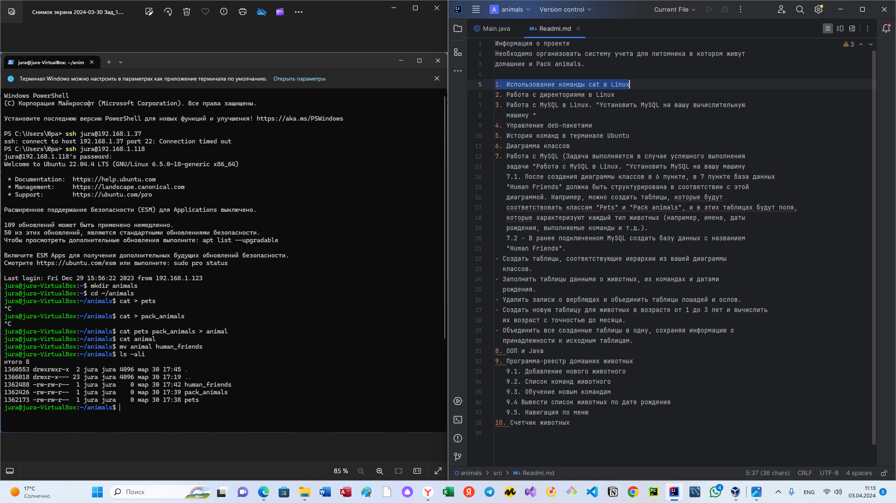
2. Работа с директориями в Linux
  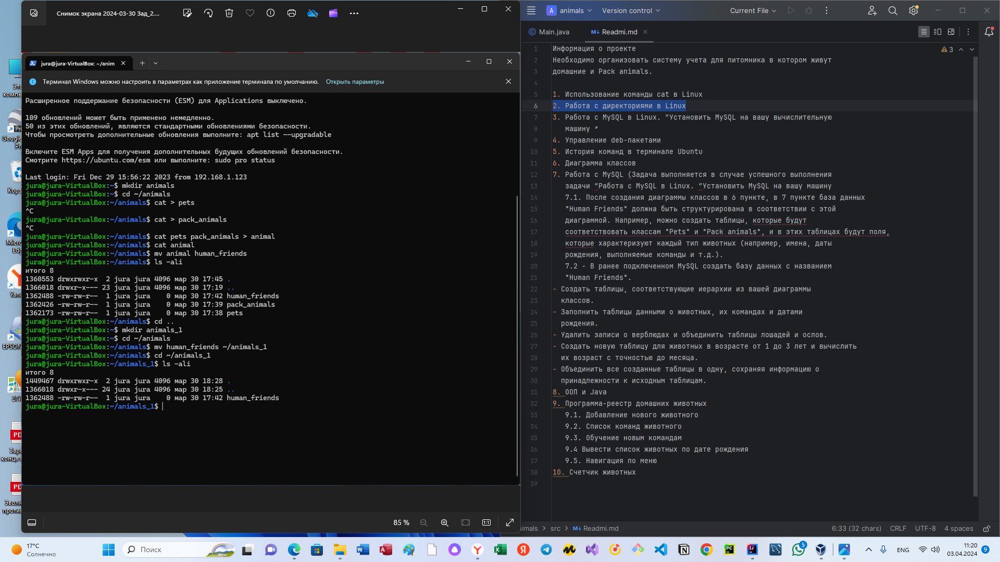
3. Работа с MySQL в Linux. “Установить MySQL на вашу вычислительную
   машину ”
   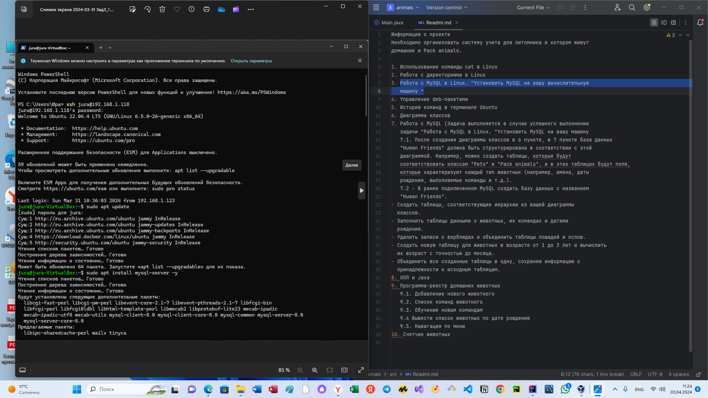
4. Управление deb-пакетами
   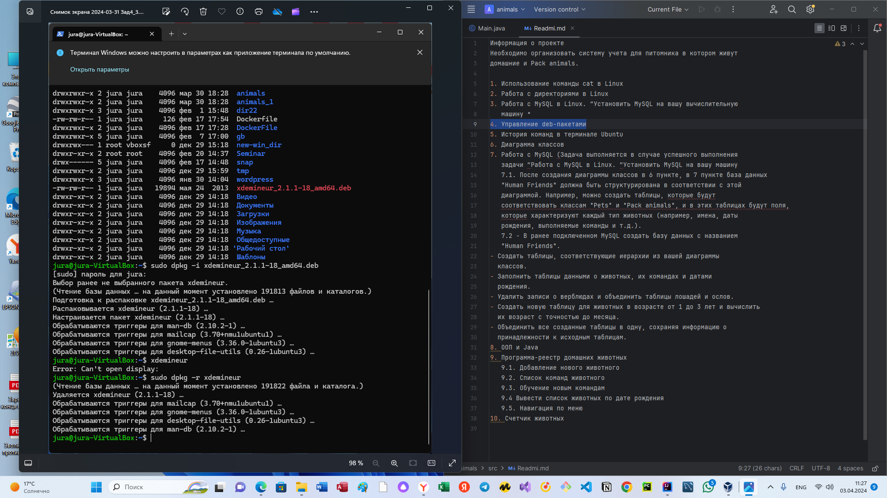
5. История команд в терминале Ubuntu

Объектно-ориентированное программирование

6. Диаграмма классов
   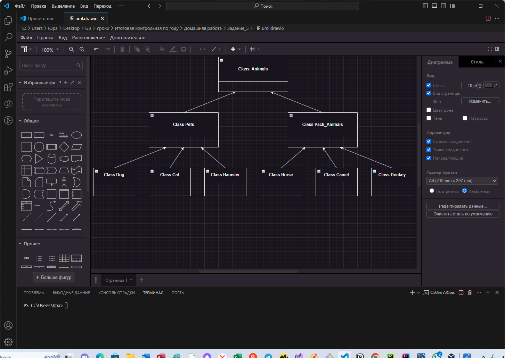
7. Работа с MySQL (Задача выполняется в случае успешного выполнения
   задачи “Работа с MySQL в Linux. “Установить MySQL на вашу машину”

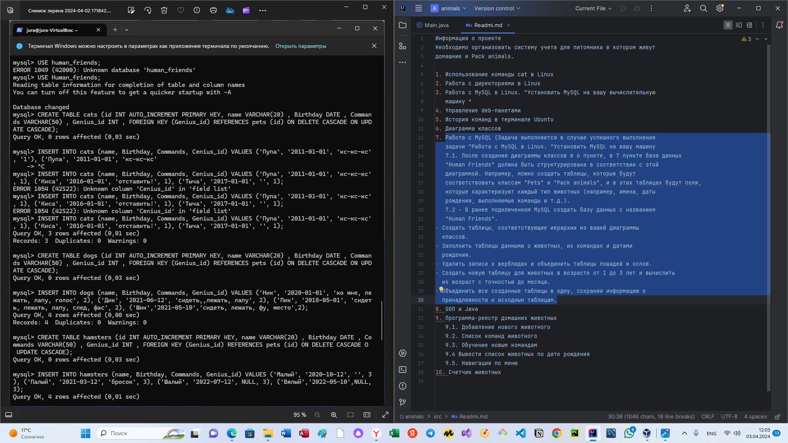
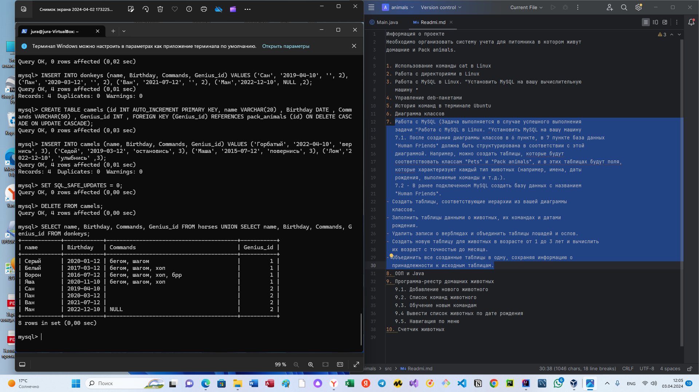
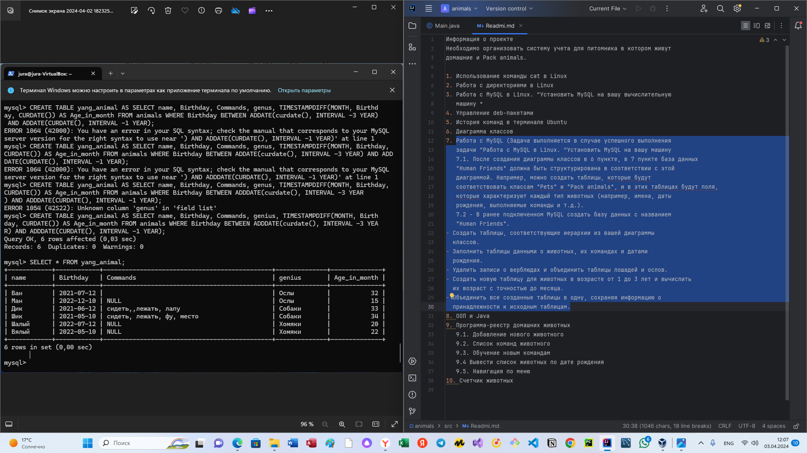
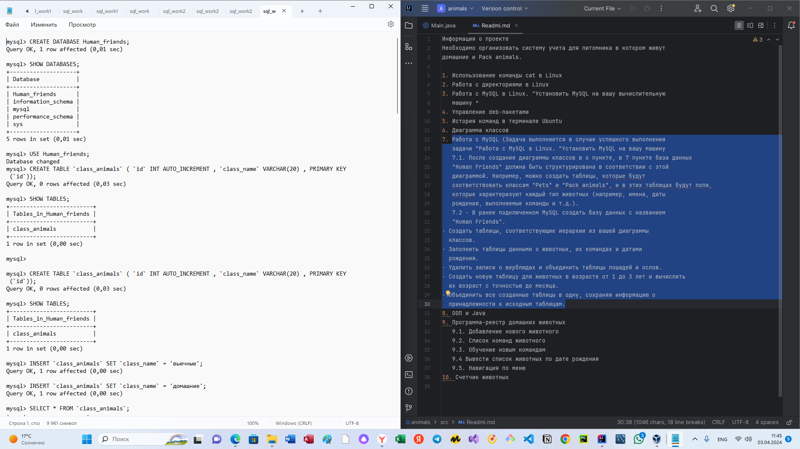
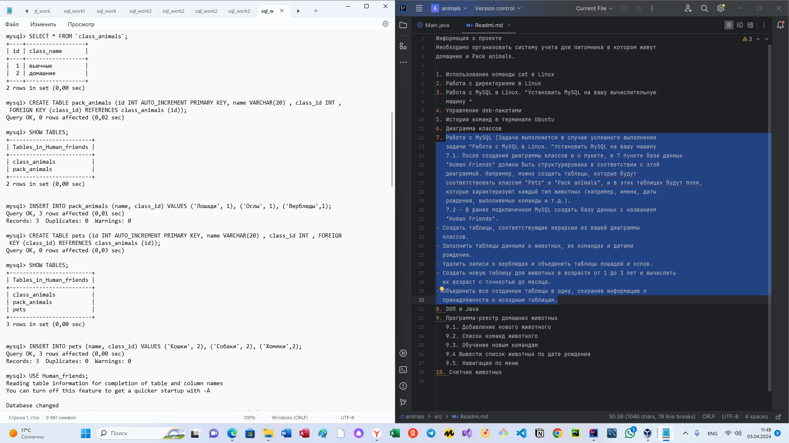
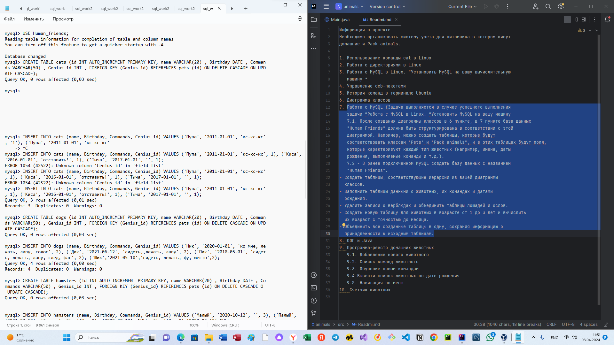
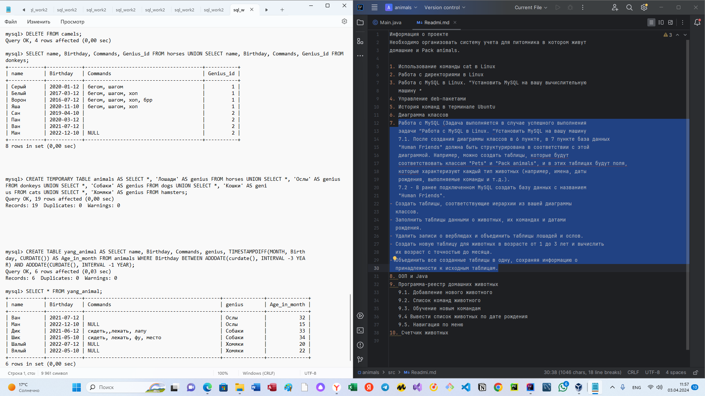
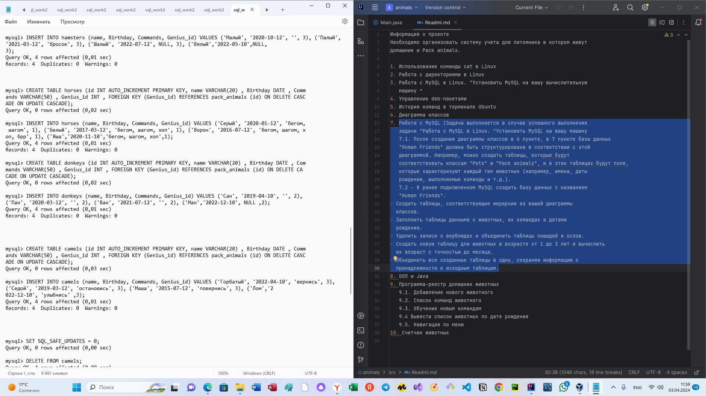

8. ООП и Java
9. Программа-реестр домашних животных
10. Счетчик животных